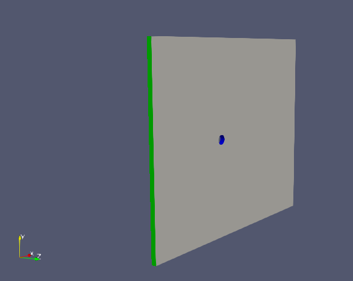
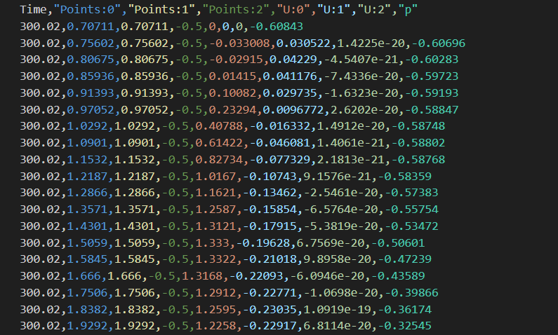

# 🧠 PINN Surrogate Model for Turbulent Flow (Navier-Stokes)

A **physics-informed neural network (PINN)** that learns the velocity field of flow around a cylinder from OpenFOAM simulation data, while being constrained by the **Navier-Stokes equations**. The goal is a fast surrogate that predicts the flow for a new inlet velocity without running a full CFD simulation.

*Course project for ICM3770, Physics-Informed Machine Learning, Pontificia Universidad Católica de Chile (Nov 2024).*

> 🚧 **Work in progress.** This was my first PINN, and the model still has clear room for improvement. The repository documents what I built, what I learned and what I plan to try next.

## 💡 Motivation

CFD tools like OpenFOAM are accurate but expensive: a turbulent cylinder case can take enormous compute time as the mesh grows. A trained PINN could answer "what does the flow look like at a new inlet velocity?" almost instantly, which is useful for design exploration and optimization.

## 📦 Data

I generated the training data myself in **OpenFOAM** with the 3D `Cylinder_URANS` case (unsteady Reynolds-averaged Navier-Stokes): water flowing past a cylinder in a 50 × 40 × 1 domain.

- Several runs with different **inlet velocities between 1 and 10 m/s**; one inlet velocity (5 m/s) held out for testing
- Fields exported at t = 300 s as CSV: coordinates (x, y, z), velocity (U) and pressure (p)
- **38,568 points per run** (18,840 internal nodes + 19,728 boundary nodes)

  
  

## 🧮 Model

Built with **DeepXDE** on a TensorFlow backend.

- **Inputs:** coordinates (x, y, z) · **Outputs:** in-plane velocity (u, v)
- **Network:** fully connected, 4 hidden layers × 65 neurons, tanh activation
- **Physics loss:** residuals of the continuity and momentum equations
  $$\nabla\cdot\mathbf{u} = 0, \qquad \rho(\mathbf{u}\cdot\nabla)\mathbf{u} - \mu\nabla^2\mathbf{u} = 0$$
- **Boundary conditions:** Dirichlet inlet velocity and zero-gradient (Neumann) outlet
- **Data:** OpenFOAM points used as anchors in the training set
- **Optimizers:** Adam, compared with L-BFGS

The code is in [`pinn_navier_stokes.ipynb`](pinn_navier_stokes.ipynb) (built to run in Google Colab).

## 📚 What I Learned

- **Geometry is the hard part.** DeepXDE could define the cuboid domain, but my own cylinder geometry produced tolerance mismatches with the boundary nodes and `NoneType` errors in the gradients, so I had to remove the cylinder and its no-slip condition from the model. That removes the physics that creates the wake, which is the main limitation of the current version.
- **Near-zero components cause trouble.** The z-velocity was close to zero in most of the domain and destabilized training, so I restricted the model to the x-y velocity components.
- **L-BFGS beats Adam for fine convergence** of the velocity gradients in this problem.
- **Network size matters.** Increasing depth and width was one of the most effective changes to reduce the test error.

## 🔜 Next Steps

- Represent the cylinder properly (for example with a CSG geometry difference) and enforce the no-slip condition on its surface
- Include pressure and the z-component, and non-dimensionalize the inputs and outputs
- Weight the PDE, boundary and data losses, and train with Adam followed by L-BFGS
- Use the inlet velocity as an extra input so one network covers the whole range of cases

## 🧰 Tools

